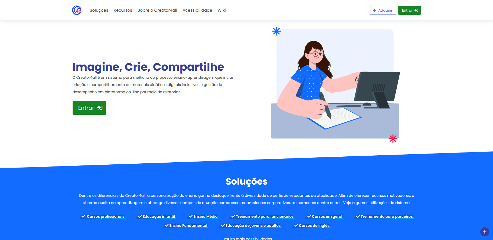
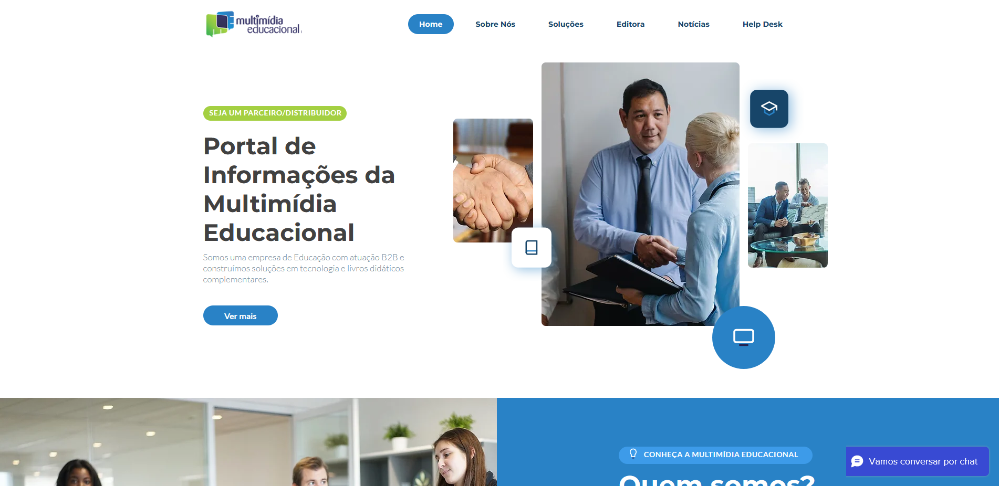

<h1>Projeto Integrador 2023</h1>

Esse projeto surge como resposta a uma demanda real da empresa Multimídia Educacional em sua ferramenta Creator4All, que necessita de uma implementação de chat em tempo real. O chat será uma adição essencial para a plataforma, permitindo uma comunicação eficiente e interativa entre os usuários.
<b>Esse projeto surge como uma forma de abordar um problema real de uma empresa, porém, não será implementado diretamente nela. Todas as informações e elementos presentes neste projeto são destinados exclusivamente para fins acadêmicos.</b>

<h3><a href="https://creator4all.com/">Creator4all</a></h3>

Ele é um sistema para melhoria do processo de aprendizagem que inclui criação e compartilhamento de materiais didáticos digitais inclusivos e gestão de desempenho por meio de relatórios. 

<h3><a href="https://www.multimidiaeducacional.com.br/">Multimidia Educacional</a></h3> 

 A Multimídia Educacional é uma empresa com mais de 20 anos de atuação na área da Educação, dedicada a fornecer soluções educacionais tecnológicas de alta qualidade, aprovado pelo MEC. Além disso, e que também produz livros de conteúdo com foco no ensino infantil e fundamental. 

